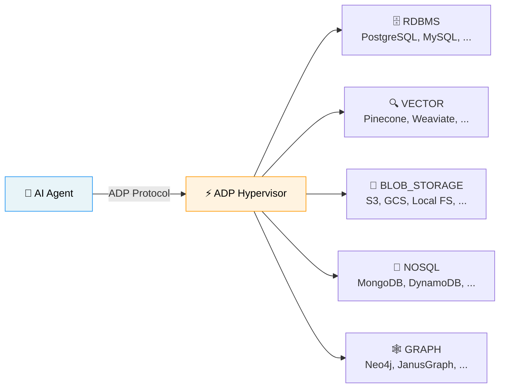
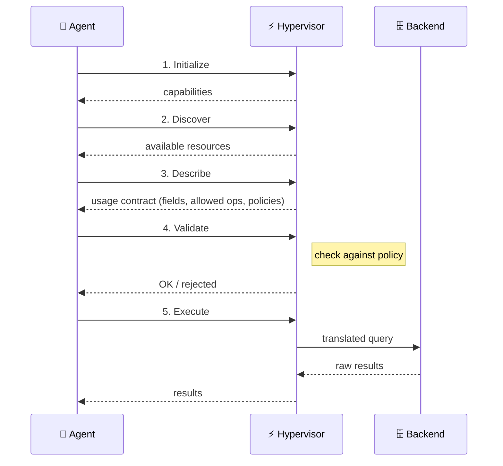

# Agentic Data Protocol (ADP)

**The open protocol for AI agents to safely discover, validate, and execute data operations — before touching your data.**

[](https://opensource.org/licenses/Apache-2.0)
[](https://github.com/agenticdataprotocol/agenticdataprotocol)
[](https://github.com/orgs/agenticdataprotocol/discussions)

---

## The Problem

AI agents today access data by generating raw queries — SQL strings, API calls, GraphQL — with no guardrails. This creates real problems:

- **No governance** — The agent decides what to read and write. There's no policy layer to say "you can query this table but not that one."
- **Fragile and non-deterministic** — Free-form query generation varies across LLMs, prompts, and runs. The same question can produce different (or broken) queries.
- **Tightly coupled** — Every new data source requires custom glue code in every agent. Swap a database and the agent breaks.

## How ADP Solves This

ADP introduces a **contract-first** approach: before an agent ever touches data, it discovers what's available, understands the rules, and validates its intent — all through a single, standardized protocol.



The agent talks ADP. The **[Hypervisor](https://github.com/agenticdataprotocol/adp-hypervisor)** translates intents into backend-native operations, enforces policies, and returns results — all without the agent knowing (or caring) what database sits behind it.

## Core Principles

**Safe by design** — Policy manifests govern which agents can access which resources. Every intent is validated *before* execution. No surprise writes, no unauthorized reads.

**Deterministic** — Agents express structured **Intent IR** (lookup, query, ingest, revise) instead of generating free-form queries. Same intent, same result — auditable and reproducible.

**Heterogeneous** — One protocol, one SDK, many backends. Connect PostgreSQL, MongoDB, pgvector, local files, and more — without changing a single line of agent code.

## How It Works

ADP defines a simple request-response flow over JSON-RPC 2.0:



Agents never write raw queries. They express **what** they want (Intent IR), and the Hypervisor decides **how** to get it — safely.

## Quick Start

### Install the [Python SDK](https://github.com/agenticdataprotocol/python-sdk)

```bash
pip install adp-sdk
```

### Connect to an ADP server

```python
import asyncio
from adp_sdk import stdio_client, basic_auth, QueryIntent, PredicateGroup

async def main():
    async with stdio_client(
        "python", ["-m", "adp_hypervisor", "--config", "config.yaml"],
        authorization=basic_auth("alice", "secret"),
    ) as session:
        # Discover available resources
        discovery = await session.discover()
        for r in discovery.resources:
            print(f"  {r.resource_id}: {r.description}")

        # Execute a query
        intent = QueryIntent(
            intentClass="QUERY",
            resourceId="com.example:users",
            predicates=PredicateGroup(op="AND", predicates=[]),
        )
        result = await session.execute(intent)
        print(f"Got {len(result.results)} rows")

asyncio.run(main())
```

For a full walkthrough with Docker and sample data, see the [Hypervisor examples](https://github.com/agenticdataprotocol/adp-hypervisor/tree/main/examples).

## Ecosystem

| Repository | What it does |
|---|---|
| **[agenticdataprotocol](https://github.com/agenticdataprotocol/agenticdataprotocol)** | Protocol specification, JSON Schema, and TypeScript types *(this repo)* |
| **[adp-hypervisor](https://github.com/agenticdataprotocol/adp-hypervisor)** | Reference server — translates intents to backend queries, enforces policies |
| **[python-sdk](https://github.com/agenticdataprotocol/python-sdk)** | Python client SDK for connecting agents to any ADP-compliant server |
| **[adp-connectors](https://github.com/agenticdataprotocol/adp-connectors)** | Connectors for LLM frameworks — MCP bridge, agent skills, and more |

### Supported Backend Types

ADP is designed to work across heterogeneous data systems. The protocol defines five backend types:

| Backend Type | Examples | Description |
|---|---|---|
| `RDBMS` | PostgreSQL, MySQL, SQLite, Oracle | Relational databases |
| `VECTOR` | Pinecone, Weaviate, Qdrant, Milvus | Vector / embedding stores |
| `BLOB_STORAGE` | S3, GCS, Azure Blob, HDFS, Local FS | Blob and file storage |
| `NOSQL` | MongoDB, DynamoDB, Cassandra | NoSQL / document stores |
| `GRAPH` | Neo4j, JanusGraph | Graph databases |

See the [Hypervisor repo](https://github.com/agenticdataprotocol/adp-hypervisor) for currently implemented backends and how to add your own.

### Framework Integrations

- **MCP Bridge** — Use ADP as an [MCP](https://modelcontextprotocol.io) server, so any MCP-compatible agent can access ADP-governed data ([adp-mcp](https://github.com/agenticdataprotocol/adp-connectors/tree/main/adp-mcp))

## Contributing

We welcome contributions — protocol proposals, SDK improvements, new backends, documentation, and bug reports. See [CONTRIBUTING.md](CONTRIBUTING.md) to get started.

Have questions or ideas? Join the conversation in [GitHub Discussions](https://github.com/orgs/agenticdataprotocol/discussions).

---

📐 Want to dive deeper into the protocol? Expand the specification details below.

<details>
<summary><strong>Protocol Specification Details</strong></summary>

### JSON-RPC Methods

ADP uses **JSON-RPC 2.0** as its transport format:

```json
{
  "jsonrpc": "2.0",
  "id": 1,
  "method": "adp.discover",
  "params": { "filter": { "domainPrefix": "com.acme" } }
}
```

| Method | Purpose | Params Type | Result Type |
|---|---|---|---|
| `adp.initialize` | Establish connection and negotiate capabilities | `InitializeRequestParams` | `InitializeResult` |
| `adp.ping` | Health check | `RequestParams` | `EmptyResult` |
| `adp.discover` | Browse available resources | `DiscoverRequestParams` | `DiscoverResult` |
| `adp.describe` | Get usage contract for a resource | `DescribeRequestParams` | `DescribeResult` |
| `adp.validate` | Dry-run validation of Intent IR | `ValidateRequestParams` | `ValidateResult` |
| `adp.execute` | Execute Intent IR against backend | `ExecuteRequestParams` | `ExecuteResult` |

### Intent Classes

| Category | Intent | Description |
|---|---|---|
| READ | `LOOKUP` | Retrieve single entity by unique key |
| READ | `QUERY` | Retrieve entity set using boolean predicates |
| WRITE | `INGEST` | Create/append new data |
| WRITE | `REVISE` | Update existing entries |

### TypeScript Types

This repository contains the canonical TypeScript type definitions and JSON Schema for the protocol. To work with the spec locally:

```bash
npm install

# Check all (TypeScript + ESLint + Prettier + JSON Schema)
npm run check

# Generate JSON Schema from TypeScript
npm run generate:schema:json

# Format code
npm run format
```

```typescript
import {
  InitializeRequest,
  DiscoverRequest,
  ExecuteRequest,
} from "./schema/2026-01-20/schema";
```

</details>

## License

Apache-2.0 — see [LICENSE](LICENSE) for details.
