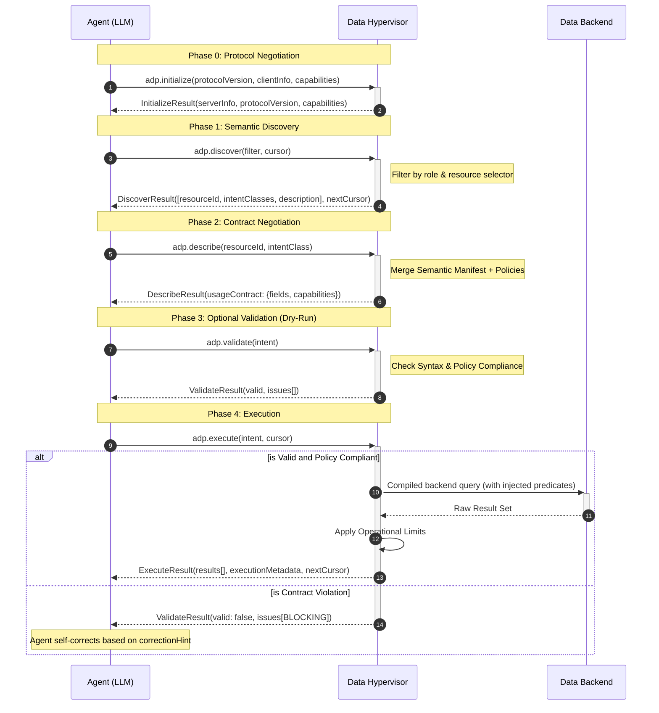

Version 2026-01-20

This ADP protocol ensures that the Agent and Hypervisor are always in "Contract Alignment." By treating every interaction as a negotiation of constraints, we eliminate the guesswork that leads to broken queries and security rejections.

## Transport: JSON-RPC 2.0

All ADP communication uses **JSON-RPC 2.0** as its transport format. Every request follows the standard envelope:

```json
{
  "jsonrpc": "2.0",
  "id": 1,
  "method": "adp.discover",
  "params": { "filter": { "domainPrefix": "com.acme" } }
}
```

Responses follow the standard JSON-RPC result or error format:

```json
{
  "jsonrpc": "2.0",
  "id": 1,
  "result": { ... }
}
```

### JSON-RPC Methods

| Method           | Purpose                                         | Params Type               | Result Type        |
| ---------------- | ----------------------------------------------- | ------------------------- | ------------------ |
| `adp.initialize` | Establish connection and negotiate capabilities | `InitializeRequestParams` | `InitializeResult` |
| `adp.ping`       | Health check / keepalive                        | `RequestParams`           | `EmptyResult`      |
| `adp.discover`   | Browse available resources                      | `DiscoverRequestParams`   | `DiscoverResult`   |
| `adp.describe`   | Get usage contract for a resource               | `DescribeRequestParams`   | `DescribeResult`   |
| `adp.validate`   | Dry-run validation of Intent IR                 | `ValidateRequestParams`   | `ValidateResult`   |
| `adp.execute`    | Execute Intent IR against backend               | `ExecuteRequestParams`    | `ExecuteResult`    |

---

## A. The ADP-Intent IR Interaction Sequence

### A1. The Interaction Verbiage

#### 1. INITIALIZE (Protocol Negotiation)

- **Interaction:** The Agent establishes a connection and negotiates the protocol version with the Hypervisor.
- **Hypervisor Action:** Confirms the protocol version and advertises its capabilities (supported intent classes).
- **Output:** Server information, agreed protocol version, and server capabilities.

#### 2. DISCOVER (The Catalog)

- **Interaction:** The Agent requests a list of visible resources.
- **Hypervisor Action:** Filters the Semantic Manifest based on the Agent's identity and returns only accessible resources.
- **Output:** A paginated list of `[resourceId, intentClasses, description, tags]`.
  - _Example:_ `com.acme.finance:bank_failures` | `intentClasses: ["QUERY"]` | `description: Historical records of US bank insolvency.`
- **Why Domain Tags?** Prefixes (like `com.acme.finance`) act as a namespace, preventing collisions and allowing the Agent to group related entities logically.

#### 3. DESCRIBE (The Usage Contract)

- **Interaction:** Agent asks "How do I specifically use `com.acme.finance:bank_failures`?"
- **Hypervisor Action:** Merges the **Semantic Manifest Schema** with **Access & Operational Policies**.
- **Output:** A **Usage Contract** containing:
  - **Fields:** Available fields with data types and metadata.
  - **Capabilities:** Predicate capabilities (REQUIRED/OPTIONAL with allowed operators), projection fields, and mutable fields for WRITE operations.
- **Policy Feedback:** The contract exposes `REQUIRED` predicates so the Agent knows which filters must be included.

#### 4. VALIDATE (The Dry-Run) — _Optional_

- **Interaction:** Agent submits a draft `Intent IR` for a "sanity check."
- **Hypervisor Action:** Performs full syntax validation, policy compliance check, and semantic mapping without touching the database.
- **Output:** A **Validation Result** with `valid` boolean and structured `issues[]` (each with severity `BLOCKING` or `WARNING`).

#### 5. EXECUTE (The Commitment)

- **Interaction:** Agent issues the finalized `Intent IR`.
- **Hypervisor Action:** Atomic validation and execution. It compiles the IR into a physical query, executes it against the backend (RDBMS/NoSQL/Vector/GraphDB/etc.), and captures logs.
- **Output:** A structured result set with optional `executionMetadata` (consistency level, duration, source system).
- **Statefulness & Feedback:** If validation fails, the Hypervisor returns structured `issues[]` with `correctionHint` fields.

---

### A2. Human & LLM Logic Specification

**To the Human:** This process turns the Hypervisor into a "Compiler for Data Intent." It prevents "Garbage In" by forcing the Agent to read the manual (`DESCRIBE`) before pressing the button (`EXECUTE`).

**To the LLM (Agent Instructions):**

> "Always call `adp.describe` before `adp.execute`. The usage contract returned by `adp.describe` contains `REQUIRED` predicates in `capabilities.predicates`. You must incorporate these into your `Intent IR`. If you receive validation issues with `severity: BLOCKING`, use the `correctionHint` to refine your next call."



---

## B. ADP Resources and Intents

### B1. Resource Identification: `resourceId`

All resources within the ADP ecosystem are addressed using a unique, structured identifier.

- **Convention**: `namespace:alias`
- **Structure**: `[Reverse-DNS-Namespace]:[Entity-Alias]`
  - **Namespace (`xxx.yyy.zzz`)**: Hierarchical namespace representing the data owner (e.g., `com.acme.finance`).
  - **Alias (`abc`)**: Unique identifier for the dataset within that namespace (e.g., `bank_failures`).
- **Example**: `com.acme.finance:bank_failures`

### B2. Supported Intent Classes

This table serves as the normative definition for all Agent interactions. Note that the intent class set has been rationalized from the draft spec — advanced read patterns (PATH, CORRELATE, SUMMARIZE) and advanced write patterns (MERGE, PRUNE) are not supported.

| **Category** | **Intent Class** | **Purpose**                                  | **Logic Mechanism**    | **Expected Output**  |
| ------------ | ---------------- | -------------------------------------------- | ---------------------- | -------------------- |
| **READ**     | **LOOKUP**       | Retrieve 1 entity by unique key.             | Identity Predicate     | Single Object        |
| **READ**     | **QUERY**        | Retrieve a set of entities.                  | PredicateExpression    | List of Objects      |
| **WRITE**    | **INGEST**       | Create or append new data entries.           | Value Payload (array)  | Operation Results    |
| **WRITE**    | **REVISE**       | Update existing entries (full or partial).   | Predicates + Payload   | Operation Results    |

Wildcard `"*"` can be used in resource definitions to accept any intent class.

### B3. Backend Mapping to ADP Intent Classes

| **Backend Type**    | **LOOKUP (Point)** | **QUERY (Set)**    | **INGEST (Create)** | **REVISE (Update)**  |
| ------------------- | ------------------ | ------------------ | ------------------- | -------------------- |
| **RDBMS**           | `PK` Lookup        | `SELECT ... WHERE` | `INSERT`            | `UPDATE ... WHERE`   |
| **Vector DB**       | `fetch(id)`        | Metadata Filter+NN | `upsert(vector)`    | `upsert(id, vector)` |
| **Graph DB**        | `MATCH (n) ID(n)`  | Property Filters   | `CREATE (n:Label)`  | `SET n.prop = x`     |
| **NoSQL**           | `GetItem`          | `Query` / `Scan`   | `PutItem`           | `UpdateItem`         |
| **BLOB_STORAGE**    | `GetObject`        | `ListObjects`      | `PutObject`         | `PutObject`          |

---

## C. Manifest Architecture

ADP uses a three-manifest architecture to separate physical, semantic, and policy concerns.

### C1. Physical Manifest (`physical.yaml`)

Defines the physical backend data sources. Each backend entry has:
- `id`: Unique identifier referenced by the Semantic Manifest.
- `type`: Backend category — `RDBMS`, `VECTOR`, `BLOB_STORAGE`, `NOSQL`, `GRAPH`.
- `provider`: Implementation variant (e.g., `postgresql`, `mysql`, `pinecone`, `mongodb`, `neo4j`). **Required** to distinguish backends with the same type.
- `config`: Backend-specific connection configuration.
- `credentials`: External credential reference (env variable, secret manager, or file).

```yaml
version: "1.0.0"

backends:
  - id: "finance_sql_pg"
    type: "RDBMS"
    provider: "postgresql"
    config:
      type: "RDBMS"
      uri: "postgresql://db.acme.com:5432/finance"
      schema: "public"
    credentials:
      type: "env"
      key: "DB_PASSWORD"

  - id: "report_vectors"
    type: "VECTOR"
    provider: "pinecone"
    config:
      type: "VECTOR"
      indexName: "bank-summaries"
      endpoint: "https://api.pinecone.io"
    credentials:
      type: "secret"
      manager: "AWS_SECRETS_MANAGER"
      key: "production/pinecone-api-key"

  # Blob Storage Backend - covers S3, GCS, local FS, HDFS, etc.
  - id: "raw_storage"
    type: "BLOB_STORAGE"
    provider: "s3"
    config:
      type: "BLOB_STORAGE"
      uri: "s3://acme-finance-datalake/"
      region: "us-east-1"
    credentials:
      type: "secret"
      manager: "AWS_SECRETS_MANAGER"
      key: "production/s3-credentials"

  # Blob Storage Backend - local file system
  - id: "local_files"
    type: "BLOB_STORAGE"
    provider: "local"
    config:
      type: "BLOB_STORAGE"
      uri: "/data/warehouse"
```

**Credential reference types:**
| Type     | Description                                       |
| -------- | ------------------------------------------------- |
| `env`    | Environment variable name                         |
| `secret` | Secret manager path (AWS, Vault, GCP, Azure, K8s) |
| `file`   | Absolute or relative file path                    |

### C2. Semantic Manifest (`semantic.yaml`)

Maps physical backends to ADP-visible resources. **Each resource is backed by exactly one source definition.** Explicitly defined resources are required — there is no auto-discovery bootstrap mode.

Key resource properties:
- `resourceId`: Domain-qualified identifier (e.g., `com.acme.finance:bank_failures`).
- `version`: Integer resource version, starting from 1.
- `intentClasses`: Intent classes this resource supports. Use `["*"]` for all.
- `backendId`: Reference to a backend defined in `physical.yaml`.
- `sourceDefinition`: The single data source within the backend (table, collection, prefix, etc.) with field definitions.

```yaml
version: "1.0.0"

resources:
  - resourceId: "com.acme.finance:bank_failures"
    intentClasses: ["QUERY"]
    version: 1
    description: "Bank failure records from FDIC"
    semanticDescription: "Historical records of bank failures including FDIC certificate numbers, closing dates, and failure summaries."
    tags: ["FINANCE", "REGULATORY", "HISTORICAL"]
    backendId: "finance_sql_pg"
    sourceDefinition:
      source: "v_failures_consolidated"
      fields:
        - fieldId: "bank_id"
          type: "STRING"
          description: "FDIC Certificate Number"
        - fieldId: "bank_name"
          type: "STRING"
          description: "Name of the failed bank"
          isSearchable: true
        - fieldId: "state_code"
          type: "STRING"
          description: "US State Abbreviation"
          metadata:
            cardinality: 50
            format: "AA"
            whitelistOnly: true
            samples: ["CA", "NY", "TX"]
        - fieldId: "closing_date"
          type: "DATE"
          description: "The date the institution was closed."
        - fieldId: "failure_summary"
          type: "STRING"
          description: "Long-form narrative of the failure event."
          isSearchable: true
```

**Field types:** `STRING`, `INTEGER`, `FLOAT`, `BOOLEAN`, `DATE`, `TIMESTAMP`, `BLOB`, `JSON`, `VECTOR`

**Multi-version resources:** A resource can have multiple versions (1, 2, 3, ...). `adp.describe` without a version returns the latest. Clients can request a specific version explicitly.

### C3. Policy Manifest (`policy.yaml`)

Defines governance policies. Each policy specifies its own scope. Three policy types are supported:

| Type               | Scope             | Description                                         |
| ------------------ | ----------------- | --------------------------------------------------- |
| `ACCESS`           | `resourceSelector` (wildcard) | RBAC: which roles can use which intent classes |
| `MANDATORY_FILTER` | `resourceId` (exact)          | Predicates the Agent _must_ include in every request |
| `OPERATIONAL`      | `resourceId` (exact)          | Enforces result limits and default sort order        |

**ACCESS policy — closed-by-default:** If no ACCESS policy matches a resource, no role/intent is permitted. Resources must be explicitly opted in.

**Resource selector syntax for ACCESS:**
- Exact: `"com.acme.finance:bank_failures"`
- All names in namespace: `"com.acme.finance:*"`
- Namespace prefix: `"com.acme.*"`, `"com.acme.finance.*"`
- Catch-all: `"*"`

**Specificity resolution:** When multiple ACCESS policies match, the most specific selector wins. Ties are resolved by merging `allowedIntents` (union). A role with `"*"` intents has access to all intent classes.

```yaml
version: "1.0.0"

policies:
  # RBAC: who can do what on bank_failures
  - type: "ACCESS"
    resourceSelector: "com.acme.finance:bank_failures"
    roles:
      - role: admin
        allowedIntents: [LOOKUP, QUERY, REVISE, INGEST]
      - role: user
        allowedIntents: [LOOKUP, QUERY]

  # Mandatory filter: always filter by closing_date in production
  - type: "MANDATORY_FILTER"
    resourceId: "com.acme.finance:bank_failures"
    fieldId: "closing_date"
    op: "GT"
    value: "2020-01-01"
    condition: "agent_tier == 'PRODUCTION'"

  # Operational: cap results and set default sort
  - type: "OPERATIONAL"
    resourceId: "com.acme.finance:bank_failures"
    enforceLimit: 100
    defaultOrderBy:
      fieldId: "closing_date"
      direction: "DESC"
```

**Bootstrap policy** (development/testing): Define a catch-all ACCESS rule granting read-only intents (`["LOOKUP", "QUERY"]`) to a `default` role.

---

## D. adp.initialize Interface Specification

### D1. Normative Description

- **Purpose**: Protocol version negotiation and capability advertisement. Sent once by the client at connection time.
- **Logic**: Client advertises its latest supported version and capabilities. The Hypervisor responds with the version it will use and its server capabilities.

### D2. adp.initialize IR Specification

#### Input: InitializeRequest

```json
{
  "jsonrpc": "2.0",
  "id": 1,
  "method": "adp.initialize",
  "params": {
    "protocolVersion": "2026-01-20",
    "clientInfo": {
      "name": "my-agent",
      "version": "1.0.0"
    },
    "capabilities": {
      "experimental": {}
    }
  }
}
```

#### Output: InitializeResult

```json
{
  "jsonrpc": "2.0",
  "id": 1,
  "result": {
    "protocolVersion": "2026-01-20",
    "serverInfo": {
      "name": "acme-hypervisor",
      "version": "2.1.0"
    },
    "capabilities": {
      "supportedIntentClasses": ["LOOKUP", "QUERY", "INGEST", "REVISE"]
    },
    "instructions": "Call adp.discover to browse available resources."
  }
}
```

---

## E. adp.discover Interface Specification

### E1. Normative Description

- **Purpose**: Identity-aware metadata browsing with cursor-based pagination.
- **Pagination Logic**: The Agent provides an optional `cursor`. The Hypervisor returns `nextCursor` if more results exist.
- **Filtering**: Filters (`domainPrefix`, `intentClass`, `keyword`) are applied before pagination.

### E2. adp.discover IR Specification

#### Input: DiscoverRequest

```json
{
  "jsonrpc": "2.0",
  "id": 2,
  "method": "adp.discover",
  "params": {
    "filter": {
      "domainPrefix": "com.acme",
      "intentClass": "QUERY",
      "keyword": "liquidity"
    },
    "cursor": null
  }
}
```

#### Output: DiscoverResult

```json
{
  "jsonrpc": "2.0",
  "id": 2,
  "result": {
    "resources": [
      {
        "resourceId": "com.acme.finance:bank_failures",
        "version": 1,
        "intentClasses": ["QUERY"],
        "description": "Bank failure records from FDIC",
        "semanticDescription": "Historical records of bank failures including FDIC certificate numbers, closing dates, and failure summaries.",
        "tags": ["FINANCE", "REGULATORY", "HISTORICAL"]
      }
    ],
    "nextCursor": "YmFuazoxMA=="
  }
}
```

### E3. Verbiage for Human & LLM

**To the Human:** Cursor-based pagination keeps the Hypervisor performant regardless of catalog size. The Agent follows `nextCursor` to retrieve additional pages.

**To the LLM (Agent Instructions):**

> "When calling `adp.discover`, always check if `nextCursor` is present. If it is and you haven't found a suitable resource, call `adp.discover` again with that value as `cursor`. Inspect `semanticDescription` to select the best resource before calling `adp.describe`."

---

## F. adp.describe Interface Specification

### F1. Normative Description

- **Purpose**: Provide a machine-readable execution contract for a specific resource.
- **Logic**: Merges the physical schema (data types), semantic definitions (field metadata), and policy constraints (required predicates).
- **Enforcement**: Any predicate with `usage: "REQUIRED"` in `capabilities.predicates` must be present in the subsequent `adp.execute` call, or the Hypervisor will reject the request.
- **Versioning**: Omit `version` to receive the latest resource version. Specify `version` to pin to a particular schema version.

### F2. adp.describe IR Specification

#### Input: DescribeRequest

```json
{
  "jsonrpc": "2.0",
  "id": 3,
  "method": "adp.describe",
  "params": {
    "resourceId": "com.acme.finance:bank_failures",
    "intentClass": "QUERY",
    "cursor": null
  }
}
```

#### Output: DescribeResult

```json
{
  "jsonrpc": "2.0",
  "id": 3,
  "result": {
    "resourceId": "com.acme.finance:bank_failures",
    "intentClass": "QUERY",
    "version": 1,
    "usageContract": {
      "fields": [
        {
          "fieldId": "state_code",
          "type": "STRING",
          "description": "US State Abbreviation",
          "metadata": {
            "cardinality": 50,
            "format": "AA",
            "whitelistOnly": true,
            "samples": ["CA", "NY", "TX"]
          }
        },
        {
          "fieldId": "failure_summary",
          "type": "STRING",
          "description": "Long-form narrative of the failure event.",
          "isSearchable": true
        },
        {
          "fieldId": "closing_date",
          "type": "DATE",
          "description": "The date the institution was closed.",
          "metadata": { "format": "YYYY-MM-DD" }
        }
      ],
      "capabilities": {
        "predicates": [
          {
            "fieldId": "state_code",
            "usage": "REQUIRED",
            "operators": ["EQ", "IN"]
          },
          {
            "fieldId": "closing_date",
            "usage": "OPTIONAL",
            "operators": ["EQ", "GT", "GTE", "LT", "LTE"]
          },
          {
            "fieldId": "failure_summary",
            "usage": "OPTIONAL",
            "operators": ["SIMILAR"]
          }
        ],
        "projections": [
          { "fieldId": "state_code" },
          { "fieldId": "failure_summary" },
          { "fieldId": "closing_date" }
        ],
        "mutables": []
      }
    },
    "nextCursor": null
  }
}
```

### F3. Normative Definitions for AI Code Generation

- **Field Definition**: The AI looks at `fields` to understand "What" data is available.
- **Constraint Application**: The AI looks at `metadata` to understand "How" to format values.
- **Role Assignment**: The AI looks at `capabilities` to understand "Can I use this field?"
  - If `intentClass` is `QUERY` or `LOOKUP`, the `mutables` list is informational only.

| **Attribute**            | **Normative Definition**                                             | **AI Interpretation**                                                             |
| ------------------------ | -------------------------------------------------------------------- | --------------------------------------------------------------------------------- |
| **`usage: "REQUIRED"`**  | The predicate **MUST** be included in the `adp.execute` payload.     | "Add this to my where-clause construction logic by default."                      |
| **`format`**             | Specifies the lexical representation (e.g., `YYYY-MM-DD`).           | "Cast my input variable to this string format before serializing JSON."           |
| **`cardinality`**        | A hint about the number of unique values in the field.               | "If low (e.g., < 20), use a categorical picker. If high, use a text search."      |
| **`whitelistOnly`**      | If `true`, only values from `samples` are valid.                     | "Validate the user input against `samples` before calling `adp.execute`."         |
| **`isSearchable: true`** | Field supports the `SIMILAR` operator for semantic/vector search.    | "Use `SIMILAR` operator with a `SimilarValue` for semantic queries."              |

---

## G. adp.execute Interface Specification

This specification is designed for **deterministic code generation**. By providing a clean schema, an Agent can map natural language intent to a valid payload with high compliance.

### G1. Intent Structures

The `intent` field in `adp.execute` (and `adp.validate`) is a discriminated union based on `intentClass`.

#### LookupIntent — Single Entity by Unique Key

```json
{
  "intentClass": "LOOKUP",
  "resourceId": "com.acme.finance:bank_failures",
  "key": {
    "fieldId": "bank_id",
    "op": "EQ",
    "value": "FDIC-10538"
  },
  "projections": ["bank_name", "closing_date", "failure_summary"]
}
```

#### QueryIntent — Filtered Set of Entities

```json
{
  "intentClass": "QUERY",
  "resourceId": "com.acme.finance:bank_failures",
  "predicates": {
    "op": "AND",
    "predicates": [
      { "fieldId": "state_code", "op": "EQ", "value": "CA" },
      { "fieldId": "closing_date", "op": "GT", "value": "2023-01-01" }
    ]
  },
  "projections": ["bank_name", "closing_date", "failure_summary"],
  "orderBy": [{ "fieldId": "closing_date", "direction": "DESC" }],
  "limit": 10
}
```

#### IngestIntent — Create or Append Data

```json
{
  "intentClass": "INGEST",
  "resourceId": "com.acme.finance:bank_failures",
  "payload": [
    {
      "bank_id": "FDIC-99999",
      "bank_name": "Example Bank",
      "state_code": "CA",
      "closing_date": "2024-06-15"
    }
  ]
}
```

#### ReviseIntent — Update Existing Data

```json
{
  "intentClass": "REVISE",
  "resourceId": "com.acme.finance:bank_failures",
  "predicates": { "fieldId": "bank_id", "op": "EQ", "value": "FDIC-10538" },
  "payload": {
    "failure_summary": "Updated summary reflecting new FDIC findings."
  }
}
```

### G2. PredicateExpression Structure

The `predicates` field in `QueryIntent` and `ReviseIntent` accepts a **PredicateExpression**, which is either a single **Predicate** or a **PredicateGroup**:

- **Single Predicate**: Use directly for simple, single-condition filters — no wrapping in a group required.
- **PredicateGroup**: Use for multiple conditions combined with `AND`, `OR`, or `NOT`. Groups can be nested.

**Single Predicate fields:**
- `fieldId`: Field to filter on
- `op`: Comparison operator (see operator table below)
- `value`: Scalar, array, or `SimilarValue` object (for `SIMILAR`)

**PredicateGroup fields:**
- `op`: Logic operator — `"AND"`, `"OR"`, or `"NOT"`
- `predicates`: Array of `Predicate` or nested `PredicateGroup` objects

**Example: Single Predicate (no logic operator wrapper needed)**

```json
{
  "intentClass": "QUERY",
  "resourceId": "com.acme.finance:bank_failures",
  "predicates": { "fieldId": "state_code", "op": "EQ", "value": "CA" },
  "projections": ["bank_name", "closing_date"]
}
```

**SimilarValue** (for vector/semantic search using the `SIMILAR` operator):
```json
{
  "text": "liquidity risk crisis",
  "vector": [0.12, -0.34, 0.56],
  "distanceFunction": "COSINE",
  "top": 5,
  "threshold": 0.75
}
```

The optional `vector` field allows passing a **pre-computed embedding** directly, avoiding redundant server-side embedding computation. `threshold` is a float (`0.0`–`1.0`).

**Predicate Operators:**

| Operator    | Description                       |
| ----------- | --------------------------------- |
| `EQ`        | Equals                            |
| `NEQ`       | Not equals                        |
| `GT`        | Greater than                      |
| `GTE`       | Greater than or equal             |
| `LT`        | Less than                         |
| `LTE`       | Less than or equal                |
| `IN`        | Value in array                    |
| `LIKE`      | Pattern matching (case-sensitive) |
| `ILIKE`     | Pattern matching (case-insensitive)|
| `CONTAINS`  | Substring / containment           |
| `SIMILAR`   | Vector / semantic similarity      |

**Example: Complex Nested Predicates**

```json
{
  "predicates": {
    "op": "AND",
    "predicates": [
      { "fieldId": "state_code", "op": "EQ", "value": "CA" },
      {
        "op": "OR",
        "predicates": [
          { "fieldId": "assets", "op": "GT", "value": 1000000000 },
          { "fieldId": "assets", "op": "LT", "value": 5000000 }
        ]
      },
      {
        "op": "NOT",
        "predicates": [
          { "fieldId": "state_code", "op": "IN", "value": ["AK", "HI"] }
        ]
      }
    ]
  }
}
```

This translates to: `state_code = 'CA' AND (assets > 1B OR assets < 5M) AND NOT state_code IN ('AK', 'HI')`

### G3. How the Agent Builds the Payload

| **Step**                    | **Action**                                                | **Logic Source**                          |
| --------------------------- | --------------------------------------------------------- | ----------------------------------------- |
| **1. Identify Mandatory**   | Find all predicates with `usage: "REQUIRED"`.             | `adp.describe → usageContract.capabilities.predicates` |
| **2. Map User Data**        | Bind user input to the specific `fieldId` names.          | User prompt + `adp.describe → usageContract.fields` |
| **3. Lexical Formatting**   | Format values (e.g., cast date to `YYYY-MM-DD`).          | `adp.describe → fields[n].metadata.format`     |
| **4. Whitelist Check**      | Verify values against `samples` if `whitelistOnly: true`. | `adp.describe → fields[n].metadata.samples`    |

### G4. adp.execute IR Specification

#### Input: ExecuteRequest

```json
{
  "jsonrpc": "2.0",
  "id": 4,
  "method": "adp.execute",
  "params": {
    "intent": {
      "intentClass": "QUERY",
      "resourceId": "com.acme.finance:bank_failures",
      "predicates": {
        "op": "AND",
        "predicates": [
          { "fieldId": "state_code", "op": "EQ", "value": "CA" },
          { "fieldId": "closing_date", "op": "GT", "value": "2023-01-01" },
          {
            "fieldId": "failure_summary",
            "op": "SIMILAR",
            "value": {
              "text": "liquidity risk",
              "distanceFunction": "COSINE",
              "top": 5
            }
          }
        ]
      },
      "projections": ["bank_name", "closing_date", "failure_summary"],
      "orderBy": [{ "fieldId": "closing_date", "direction": "DESC" }],
      "limit": 5
    },
    "cursor": null
  }
}
```

#### Output: ExecuteResult

```json
{
  "jsonrpc": "2.0",
  "id": 4,
  "result": {
    "results": [
      {
        "bank_name": "Silicon Valley Bank",
        "closing_date": "2023-03-10",
        "failure_summary": "The institution faced severe liquidity constraints following..."
      }
    ],
    "executionMetadata": {
      "consistency": "STRONG",
      "sourceSystem": "finance_sql_pg",
      "durationMs": 142
    },
    "nextCursor": "cmVjX2lkOjEy"
  }
}
```

### G5. Normative Enforcement Table

| **Rule**        | **Enforcement**                               | **Hypervisor Response if Violated**             |
| --------------- | --------------------------------------------- | ----------------------------------------------- |
| **Presence**    | All `REQUIRED` predicates must exist.         | Validation issue: `MISSING_REQUIRED_PREDICATE`  |
| **Integrity**   | `fieldId` must be in the usage contract.      | Validation issue: `FIELD_NOT_FOUND`             |
| **Format**      | `value` must match the `format` hint.         | Validation issue: `INVALID_FORMAT`              |
| **Projection**  | `projections` must only include fields accessible to the role. | Validation issue: `FIELD_NOT_PERMITTED`     |
| **Operator**    | `op` must be in the field's allowed operators.| Validation issue: `INVALID_OPERATOR`            |
| **Cardinality** | `IN` clause or `limit` may not exceed bounds. | Validation issue: `CARDINALITY_EXCEEDED`        |

---

## H. adp.validate Interface Specification

### H1. Normative Description

- **Purpose**: Dry-run validation of an `Intent IR` against the Resource Contract and active Policies.
- **Scope**: Checks for mandatory predicates, data type/format alignment, projection permissions, and operator validity.
- **Outcome**: Returns a boolean `valid` status. If `false`, provides a structured `issues` array for Agent self-correction.
- **Idempotency**: `adp.validate` MUST NOT change the state of the data backend.

### H2. adp.validate IR Specification

#### Input: ValidateRequest

The input wraps the same `Intent IR` used in `adp.execute`.

```json
{
  "jsonrpc": "2.0",
  "id": 5,
  "method": "adp.validate",
  "params": {
    "intent": {
      "intentClass": "QUERY",
      "resourceId": "com.acme.finance:bank_failures",
      "predicates": {
        "op": "AND",
        "predicates": [
          { "fieldId": "closing_date", "op": "GT", "value": "23-01-01" }
        ]
      },
      "projections": ["bank_name", "closing_date"]
    }
  }
}
```

#### Output: ValidateResult

```json
{
  "jsonrpc": "2.0",
  "id": 5,
  "result": {
    "valid": false,
    "issues": [
      {
        "code": "MISSING_REQUIRED_PREDICATE",
        "severity": "BLOCKING",
        "field": "state_code",
        "message": "The predicate 'state_code' is required for this resource.",
        "correctionHint": "Add a predicate for 'state_code' with operator EQ or IN."
      },
      {
        "code": "INVALID_FORMAT",
        "severity": "BLOCKING",
        "field": "closing_date",
        "message": "Value '23-01-01' does not match required format YYYY-MM-DD.",
        "correctionHint": "Reformat the date as '2023-01-01'."
      }
    ]
  }
}
```

### H3. Validation Logic Categories

| **Category**    | **Validation Logic**                                       | **Agent Action on Failure**                                  |
| --------------- | ---------------------------------------------------------- | ------------------------------------------------------------ |
| **Contractual** | Are all `REQUIRED` predicates present?                     | Re-read `adp.describe` result and find the missing predicate. |
| **Syntactic**   | Do values match the `format` (e.g., Date vs. String)?      | Re-format the value string (e.g., cast to ISO 8601).         |
| **Policy**      | Is the Agent allowed to see the requested `projections`?   | Remove fields not permitted by the access policy.            |
| **Operator**    | Is the operator in the field's `operators` list?           | Switch to an allowed operator from the usage contract.       |
| **Cardinality** | Is the `IN` clause too large or the `limit` too high?      | Narrow the search or reduce the `limit` parameter.           |

### H4. Issue Severity Levels

- **`BLOCKING`**: Execution will fail. The Agent _must_ fix this before calling `adp.execute`.
- **`WARNING`**: Execution will proceed, but data may be truncated or different than expected.

### H5. Validation Issue Codes

| **Code**                    | **Description**                                 |
| --------------------------- | ----------------------------------------------- |
| `MISSING_REQUIRED_PREDICATE`| A required predicate is absent from the intent. |
| `FIELD_NOT_FOUND`           | The `fieldId` does not exist in the resource.   |
| `FIELD_NOT_PERMITTED`       | The field is not accessible to the requesting role. |
| `INVALID_OPERATOR`          | The operator is not allowed for this field.     |
| `INVALID_VALUE`             | The value type doesn't match the field type.    |
| `INVALID_FORMAT`            | The value format doesn't match the format hint. |
| `CARDINALITY_EXCEEDED`      | Too many distinct values or limit too high.     |

---

## I. Unified View: The ADP Interface Flow

| **Call**             | **Core Input**                  | **Core Output**                   |
| -------------------- | ------------------------------- | --------------------------------- |
| **adp.initialize()** | `protocolVersion`, `clientInfo` | `serverInfo`, `capabilities`      |
| **adp.ping()**       | _(empty)_                       | _(empty)_                         |
| **adp.discover()**   | `filter`, `cursor`              | `resources[]`, `nextCursor`       |
| **adp.describe()**   | `resourceId`, `intentClass`     | `usageContract`, `nextCursor`     |
| **adp.validate()**   | `intent`                        | `valid` (bool), `issues[]`        |
| **adp.execute()**    | `intent`, `cursor`              | `results[]`, `executionMetadata`, `nextCursor` |

### I1. The Required Predicate Mechanism

We put the enforcement logic into the **Usage Contract** returned by `adp.describe`.

**Behavioral Logic for the Agent:**

1. **Contract Inspection**: Agent calls `adp.describe(resourceId, intentClass)`.
2. **Logic Mapping**: Hypervisor returns `capabilities.predicates` with `usage: "REQUIRED"` or `"OPTIONAL"`.
3. **Constraint Injection**: The Agent **must** include a `Predicate` for every `REQUIRED` field in its `adp.execute` call.
4. **Enforcement**: If a `REQUIRED` predicate is missing, the Hypervisor returns a validation issue with `code: "MISSING_REQUIRED_PREDICATE"` and `severity: "BLOCKING"`.

### I2. Why `adp.validate()` is separate from `adp.execute()`

- **Cost Efficiency**: Prevents expensive backend scans that would have failed anyway due to missing required predicates or access violations.
- **Security**: Prevents probe-based exfiltration where an agent tries different fields to see what passes.
- **Agent Confidence**: Allows the Agent to iterate on its internal code generation until it achieves `valid: true`, ensuring a high "Success on First Strike" rate.

### I3. Execution Metadata

The `executionMetadata` field in `adp.execute` results provides observability:

| **Field**       | **Type**   | **Description**                                        |
| --------------- | ---------- | ------------------------------------------------------ |
| `consistency`   | enum       | `"STRONG"` or `"EVENTUAL"` — data freshness guarantee |
| `sourceSystem`  | string     | Backend ID that served the request                     |
| `durationMs`    | integer    | Total execution time in milliseconds                   |
