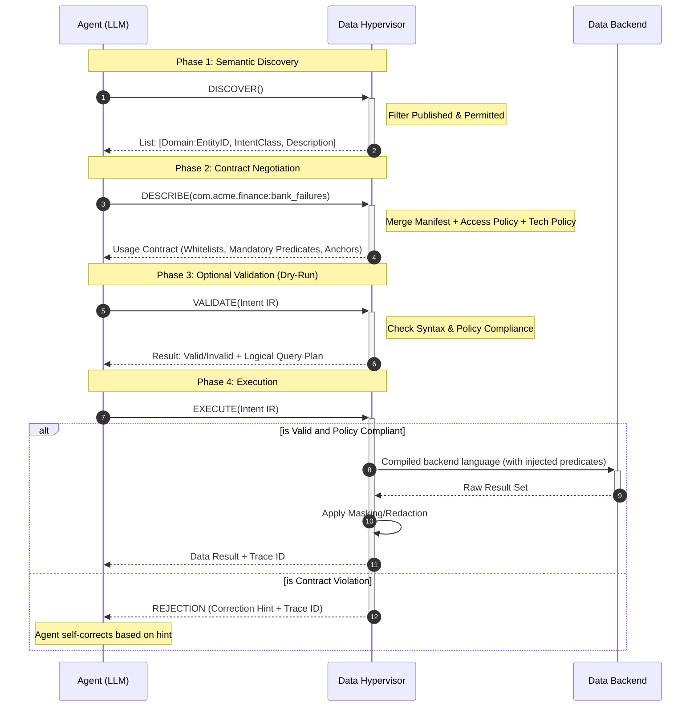

Version 2026.01.20

This ADP protocol ensures that the Agent and Hypervisor are always in "Contract Alignment." By treating every interaction as a negotiation of constraints, we eliminate the guesswork that leads to broken queries and security rejections.

## A. The ADP-Intent IR Interaction Sequence

---

### A1. The Interaction Verbiage

#### 1. DISCOVER (The Catalog)

- **Interaction:** The Agent requests a list of visible resources.
- **Hypervisor Action:** Filters the Manifest based on the Agent's identity and returns only `PUBLISHED` entities.
- **Output:** A list of `[Domain-Qualified Entity ID, Intent Class, Semantic Description]`.
  - _Example:_ `com.acme.finance:bank_failures` | `IntentClass: Query` | `Description: Historical records of US bank insolvency.`
- **Why Domain Tags?** Prefixes (like `com.acme.finance`) act as a namespace, preventing collisions and allowing the Agent to group related entities logically.

#### 2. DESCRIBE (The Usage Contract)

- **Interaction:** Agent asks "How do I specifically use `com.acme.finance:bank_failures`?"
- **Hypervisor Action:** Merges the **Manifest Schema** with **Access & Technical Policies**.
- **Output:** A **Usage Contract** containing:
  - **Projections:** Permitted fields (with masked fields flagged).
  - **Mandatory Predicates:** Policy-enforced filters (e.g., `date > '2020-01-01'`) that the Agent _must_ include or expect.
  - **Whitelists/Clues:** Allowed enums for specific fields (e.g., `State` must be from a specific list).
  - **Anchors:** Performance requirements (e.g., "Must filter by `Bank_Name`").
- **Policy Feedback:** The contract explicitly labels constraints as `SYSTEM_ENFORCED` so the Agent knows which parts of the query it cannot override.

#### 3. VALIDATE (The Dry-Run) — _Optional_

- **Interaction:** Agent submits a draft `Intent IR` for a "sanity check."
- **Hypervisor Action:** Performs full syntax validation, policy compliance check, and semantic mapping without touching the database.
- **Output:** A **Validation Result** and a **Logical Query Plan**.
  - The Logical Plan shows ~~the Agent exactly how the Hypervisor intends to translate the IR into SQL (including injected policy filters). This allows the Agent to self-correct if the plan doesn't match its intent.~~

#### 4. EXECUTE (The Commitment)

- **Interaction:** Agent issues the finalized `Intent IR`.
- **Hypervisor Action:** Atomic validation and execution. It compiles the IR into a physical query, executes it against the backend (RDBMS/NoSQL/Vector/GraphDB/etc.), and captures logs.
- **Output:** A structured result set wrapped with a **Trace ID**.
- **Statefulness & Feedback:** If the execution fails at this late stage, the Hypervisor returns a "Correction Hint." Instead of a generic `SQL Error`, it returns: _"Rejection: Filter value 'CA' for 'State' is invalid. Did you mean 'California'?"_

---

### A2. Human & LLM Logic Specification

**To the Human:** This process turns the Hypervisor into a "Compiler for Data Intent." It prevents "Garbage In" by forcing the Agent to read the manual (`DESCRIBE`) before pressing the button (`EXECUTE`).

**To the LLM (Agent Instructions):**

> "Always call `DESCRIBE` before `EXECUTE`. The contract returned by `DESCRIBE` contains `SYSTEM_ENFORCED` predicates. You must incorporate these into your `Intent IR`. If you receive a `REJECTION`, use the `Correction Hint` and `Trace ID` provided in the error message to refine your next call."



## B. ADP Resources and Intents

### B1. Resource Identification: `qualified_id`

All resources within the ADP ecosystem are addressed using a unique, structured identifier.

- **Convention**: `xxx.yyy.zzz:abc`
- **Structure**: `[Reverse-DNS-Domain]:[Entity-Alias]`
  - **Domain (`xxx.yyy.zzz`)**: Hierarchical namespace representing the data owner (e.g., `com.acme.finance`).
  - **Alias (`abc`)**: Unique identifier for the dataset within that domain (e.g., `bank_failures`).

### B2. Unified ADP Intent Class Description Table

This table serves as the normative definition for all Agent interactions.

| **Category**  | **Intent Class** | **Purpose**                                        | **Logic Mechanism**           | **Expected Output**  |
| ------------- | ---------------- | -------------------------------------------------- | ----------------------------- | -------------------- |
| **READ**      | **LOOKUP**       | Retrieve 1 entity by unique key.                   | Identity Predicate            | Single Object        |
| **READ**      | **QUERY**        | Retrieve a set of entities.                        | Boolean Predicates            | List of Objects      |
| **READ**      | **PATH**         | Traverse **variable-depth** network linkages.      | Connectivity/Depth Predicates | Graph/Path/Tree      |
| **READ**      | **CORRELATE**    | Merge distinct entity types via **shared keys**.   | Relationship/Join Predicates  | Merged/Flattened Set |
| **READ**      | **SUMMARIZE**    | Compute statistics or aggregations.                | Predicates + Math Ops         | Scalar or Table      |
| **WRITE**     | **INGEST**       | Create or append new data entries.                 | Value Payload                 | Success/ID           |
| **WRITE**     | **REVISE**       | Update existing entries (full/partial).            | Predicates + Updates          | Success Status       |
| **WRITE**     | **PRUNE**        | Remove or archive specific data.                   | Selection Predicates          | Success Status       |
| **WRITE**     | **MERGE**        | Idempotent Upsert (Update if exists, else Create). | dentity + Value Payload       | Success/ID           |
| **COGNITIVE** | **SYNTHESIZE**   | Transform/Extract structure from blobs.            | Processing Logic              | Structured JSON      |

### B2. Major Backend Mapping to ADP Intent Classes

This map shows how the Hypervisor translates the abstract **Intent Class** and **Predicates** into physical backend operations.

| **Backend Type**   | **LOOKUP (Point)** | **QUERY (Set)**        | **PATH **            | CORRLATE (Relationship)            | **REVISE (Update)**     | MERGE (Upsert)          |
| ------------------ | ------------------ | ---------------------- | -------------------- | ---------------------------------- | ----------------------- | ----------------------- |
| **RDBMS** (SQL)    | `PK` Lookup        | `SELECT ... WHERE`     | Recursive CTEs       | `INNER/LEFT/CROSS JOIN`            | `UPDATE ... WHERE`      | MERGE INTO              |
| **BigQuery**       | N/A (Scan)         | Partitioned Scan       | N/A                  | Dataset/Table Joins                | DML Update              | N/A                     |
| **Vector DB**      | `fetch(id)`        | Metadata Filter + NN   | N/A                  | Metadata-based lookup              | `upsert(id, vector)`    | upsert(id, vector)      |
| **Graph DB**       | `MATCH (n) ID(n)`  | Property Filters       | `MATCH (p)-[r]->(q)` | `MATCH (a), (b) WHERE a.id = b.id` | `SET n.prop = x`        | MERGE (n:Label {id:x})  |
| **NoSQL** (KV/Doc) | `GetItem`          | `Query` (GSI) / `Scan` | N/A                  | N/A                                | `UpdateItem`            | `PutItem` (Overwrites)  |
| **Object Store**   | `GetObject`        | `ListObjects` + Prefix | N/A                  | Metadata-key cross-reference       | `PutObject` (Overwrite) | `PutObject` (Overwrite) |
| **GraphQL**        | Query by ID        | Query w/ Args          | Nested Selection     | Argument-based Linkage             | Mutation                |                         |

## C. The "Required Predicate" Mechanism

we put the enforcement logic into the **Usage Contract**.

#### **Behavioral Logic for the Agent:**

1. **Contract Inspection**: Agent calls `DESCRIBE(qualified_id)`.
2. **Logic Mapping**: Hypervisor returns a list of fields and their requirements (e.g., `State: {usage: "REQUIRED"}`).
3. **Constraint Injection**: The Agent **must** include a `Predicate` for `State` in its `EXECUTE` call.
4. **Enforcement**: If the `Predicate` is missing, the Hypervisor returns a **400 Bad Request** with a "Correction Hint" identifying the missing required predicate

## D. ADP.Discover Interface Specification

#### D1. **Normative Description**

- **Purpose**: Identity-aware metadata browsing with windowed results.
- **Pagination Logic**: The Agent provides a `limit` and an optional `offset` (or `page`). The Hypervisor returns a `pagination` object containing metadata for the next logical request.
- **Filtering**: Filters (Domain, Intent, Keyword) are applied **before** pagination is calculated.

### D2. ADP.Discover IR Specification

#### **Input: DiscoverRequest**

```JSON
{
  "filter": {
    "domain_prefix": "com.acme",
    "intent_class": "QUERY",
    "keyword": "liquidity"
  },
  "limit": 10,
  "cursor": null
}
```

Output: DiscoverResponse

```JSON
{
  "resources": [
    {
      "qualified_id": "com.acme.finance:bank_failures",
      "version": "1.2.0",
      "intent_class": "QUERY",
      "summary": "Historical US bank insolvency records.",
      "semantic_description": "Comprehensive dataset of bank closures since 2000. Best for macro-economic risk analysis.",
      "tags": ["PII-FREE", "FINANCE"]
    }
  ],
  "pagination": {
    "field_records": 45,
    "limit": 10,
    "has_more": true,
    "next_cursor": "YmFuazoxMA=="
  },
  "trace_id": "disc-550e8400"
}
```

### D3. Verbiage for Human & LLM

**To the Human:** The `pagination` block allows the Hypervisor to remain performant regardless of the size of the underlying manifest. By returning `has_more` and `next_offset`, we provide a clear "state" for the Agent to follow if it needs to continue searching.

**To the LLM (Agent Instructions):**

> "When calling `Discover()`, always check the `pagination.has_more` field. If `true` and you haven't found a suitable entity, call `Discover()` again with the `offset` set to `next_offset`. Do not attempt to process more than 20 entities at once to maintain reasoning accuracy."

- **Version Tracking**: If an Agent receives a `version` mismatch, it knows it must invalidate its local "Describe" cache for that entity.
- **Summarization**: By splitting `summary` and `semantic_description`, we allow the LLM to perform a two-stage filter: "Scan titles/summaries first, then read deep descriptions only for top candidates."

## E. ADP.Describe Interface Specification

### E1. **Normative Description**

- **Purpose**: To provide a machine-readable execution contract for a specific resource.
- **Logic**: It merges physical schema (data types), logical constraints (predicates), and semantic clues (cardinality/formats).
- **Enforcement**: Any predicate labeled `REQUIRED` must be present in the subsequent `Execute()` call, or the Hypervisor will reject the request.

---

### E2. ADP.Describe IR Specification (JSON Schema)

#### **Input JSON schema**

```JSON
{
  "$schema": "https://adp.spec/v1/describe-request.schema.json",
  "title": "ADP Describe Request (Batch)",
  "type": "array",
  "minItems": 1,
  "items": {
    "type": "object",
    "required": ["qualified_id", "intent_class"],
    "properties": {
      "qualified_id": {
        "type": "string",
        "description": "Hierarchical ID following domain:alias convention.",
        "pattern": "^[a-z0-9.]+:[a-z0-9_]+$",
        "example": "com.acme.finance:bank_failures"
      },
      "intent_class": {
        "type": "string",
        "enum": [
          "LOOKUP", "QUERY", "PATH", "CORRELATE", "SUMMARIZE",
          "INGEST", "REVISE", "MERGE", "PRUNE"
        ]
      },
      "limit": {
        "type": "integer",
        "default": 100,
        "description": "Number of fields to return in the fields catalog."
      },
      "cursor": {
        "type": ["string", "null"],
        "default": null,
        "description": "Cursor for paginating through large schemas."
      }
    }
  }
}
```

#### **Output JSON schema**

```JSON
{
  "$schema": "https://adp.spec/v1/describe-response.schema.json",
  "title": "ADP Describe Response (Batch)",
  "type": "array",
  "items": {
    "type": "object",
    "required": ["status", "resource", "usage_contract", "pagination", "trace_id"],
    "properties": {
      "status": { "enum": ["SUCCESS", "UNAUTHORIZED", "NOT_FOUND", "ERROR"] },
      "resource": {
        "type": "object",
        "properties": {
          "qualified_id": { "type": "string" },
          "intent_class": { "type": "string" },
          "version": { "type": "string" }
        }
      },
      "usage_contract": {
        "type": "object",
        "properties": {
          "fields": {
            "type": "array",
            "description": "The canonical catalog of available fields.",
            "items": {
              "type": "object",
              "required": ["fieldId", "type"],
              "properties": {
                "fieldId": { "type": "string", "description": "The unique field identifier." },
                "type": { "type": "string" },
                "description": { "type": "string" },
                "samples": { "type": "array", "items": { "type": "string" } },
                "is_masked": { "type": "boolean", "default": false },
                "metadata": {
                  "type": "object",
                  "properties": {
                    "cardinality": { "type": ["integer", "string"] },
                    "format": { "type": "string" },
                    "whitelist_only": { "type": "boolean" },
                    "hint": { "type": "string" }
                  }
                }
              }
            }
          },
          "capabilities": {
            "type": "object",
            "properties": {
              "predicates": {
                "type": "array",
                "items": {
                  "type": "object",
                  "required": ["fieldId", "usage", "operators"],
                  "properties": {
                    "fieldId": { "type": "string" },
                    "usage": { "enum": ["REQUIRED", "OPTIONAL"] },
                    "operators": { "type": "array", "items": { "type": "string" } },
                    "params": {
                      "type": "object",
                      "description": "Detailed criteria for complex operators like SIMILAR.",
                      "properties": {
                        "accepted_media_types": { "type": "array", "items": { "type": "string" } },
                        "distance_functions": { "type": "array", "items": { "type": "string" } },
                        "top_max": { "type": "integer" },
                        "supports_threshold": { "type": "boolean" }
                      }
                    }
                  }
                }
              },
              "projections": {
                "type": "array",
                "items": {
                  "type": "object",
                  "properties": { "fieldId": { "type": "string" } }
                }
              },
              "mutables": {
                "type": "array",
                "description": "Fields that can be modified for WRITE intents (INGEST, REVISE, MERGE).",
                "items": {
                  "type": "object",
                  "properties": {
                    "fieldId": { "type": "string" },
                    "constraints": { "type": "object" }
                  }
                }
              }
            }
          }
        }
      },
      "pagination": {
        "type": "object",
        "required": ["has_more"],
        "properties": {
          "total_fields": { "type": "integer" },
          "limit": { "type": "integer" },
          "has_more": { "type": "boolean" },
          "next_cursor": { "type": ["string", "null"] }
        }
      },
      "trace_id": { "type": "string" }
    }
  }
}
```

#### Normative Example: Multi-Resource Describe

In this example, the Agent is asking for a `QUERY` contract for a Bank Failure table and a `CORRELATE` contract for a State Demographics table.

**Request:**

```JSON
[
  { "qualified_id": "com.acme.finance:bank_failures", "intent_class": "QUERY" },
  { "qualified_id": "com.acme.geo:state_stats", "intent_class": "CORRELATE" }
]
```

**Response:**

```JSON
[
  {
    "status": "SUCCESS",
    "resource": {
      "qualified_id": "com.acme.finance:bank_failures",
      "version": "1.2.0",
      "intent_class": "QUERY"
    },
    "usage_contract": {
      "fields": [
        {
          "fieldId": "state_code",
          "type": "STRING",
          "description": "US State Abbreviation",
          "samples": ["NY", "FL"],
          "metadata": { "cardinality": 50, "format": "AA", "whitelist_only": true }
        },
        {
          "fieldId": "routing_number",
          "type": "STRING",
          "description": "ABA Number",
          "is_masked": true
        },
        {
          "fieldId": "failure_summary",
          "type": "STRING",
          "description": "Long-form text summary of the failure event.",
          "metadata": { "similarity_searchable": true }
        }
      ],
      "capabilities": {
        "predicates": [
          { "fieldId": "state_code", "usage": "REQUIRED", "operators": ["EQ", "IN"] },
          { "fieldId": "failure_summary", "usage": "OPTIONAL", "operators": ["SIMILAR"], "params": { "accepted_media_types": ["text/plain"], "distance_functions": ["COSINE"], "top_max": 20 } }
        ],
        "projections": [
          { "fieldId": "state_code" },
          { "fieldId": "failure_summary" },
          { "fieldId": "routing_number" }
        ],
        "mutables": []
      }
    },
    "pagination": { "total_fields": 15, "limit": 50, "has_more": false, "next_cursor": null },
    "trace_id": "desc-tx-101"
  },
  {
    "status": "SUCCESS",
    "resource": {
      "qualified_id": "com.acme.geo:state_stats",
      "version": "1.0.0",
      "intent_class": "CORRELATE"
    },
    "usage_contract": {
      "fields": [
        {
          "fieldId": "st_abbr",
          "type": "STRING",
          "description": "State Abbreviation for Join",
          "metadata": { "hint": "Correlate this with bank_failures.state_code" }
        },
        {
          "fieldId": "pop_count",
          "type": "INTEGER",
          "description": "Population"
        }
      ],
      "capabilities": {
        "predicates": [
          { "fieldId": "st_abbr", "usage": "REQUIRED", "operators": ["EQ"] }
        ],
        "projections": [
          { "fieldId": "st_abbr" },
          { "fieldId": "pop_count" }
        ],
        "mutables": [
          { "fieldId": "pop_count", "constraints": { "min": 0 } }
        ]
      }
    },
    "pagination": { "total_fields": 15, "limit": 50, "has_more": false, "next_cursor": null },
    "trace_id": "desc-tx-101"
  }
]
```

### E3. Normative Definitions for AI Code Generation

- **Field Definition**: The AI looks at `fields` to understand the "What."
- **Constraint Application**: The AI looks at `metadata` to understand the "How" (formatting).
- **Role Assignment**: The AI looks at `capabilities` to understand the "Can."
  - If `intent_class` is `QUERY`, it ignores `mutables`.
  - If `is_masked` is `true`, it informs the user that sensitive data will be redacted

To ensure an AI can generate valid code from this spec, we define the following "Logic Hints":

| **Attribute**         | **Normative Definition**                                                            | **AI Interpretation**                                                             |
| --------------------- | ----------------------------------------------------------------------------------- | --------------------------------------------------------------------------------- |
| **`usage: REQUIRED`** | The predicate **MUST** be included in the `Execute` payload.                        | "Add this to my `where` clause construction logic by default."                    |
| **`format`**          | Specifies the lexical representation (e.g., `YYYY-MM-DD`).                          | "Cast my input variable to this string format before serializing JSON."           |
| **`cardinality`**     | A hint about the number of unique values in the field.                              | "If low (e.g., < 20), use a categorical picker/enum. If high, use a text search." |
| **`whitelist_only`**  | If `true`, only values provided in `examples` or a separate `clues` list are valid. | "Validate the user input against this list before calling Execute."               |
| **`is_masked`**       | if true, Fields that exist but are redacted or hidden by policy.                    | "Do not attempt to include these in my SELECT/Projection list."                   |
|                       |                                                                                     |                                                                                   |

### E 4. Interaction Verbiage

**To the Human:** This specification moves the complexity of "knowing the data" out of the Agent's long-term memory and into a just-in-time contract. By providing `cardinality` and `format`, we prevent common "Data Mismatch" errors (e.g., the Agent sending a timestamp when the DB expects a date).

**To the LLM (Agent Execution logic):**

> "Read the `usage_contract` carefully. Identify all `REQUIRED` predicates. For each predicate, verify your input matches the `format` (e.g., `YYYY-MM-DD`). If `whitelist_only` is true, your `value` must be an exact match from the provided examples. Construct your `Execute` IR using only `allowed_fields`."

In the **Execute()** phase, the Agent transitions from "learning" to "doing." It treats the **Usage Contract** from the `Describe()` call as its governing logic.

The Agent follows a strict **Logic-Bind-Serialize** cycle: it **Logically** selects predicates, **Binds** them to validated user inputs according to format rules, and **Serializes** the final Intent IR.

## F. ADP.Execute Interface Specification

This specification is designed for **deterministic code generation**. By providing a clean schema, an Agent (or a transpiler) can map natural language intent to a valid payload with 100% compliance.

### **F1. ADP.Execute IR Specification**

#### **Input: ExecuteRequest JSON schema**

```JSON
{
  "$schema": "https://adp.spec/v1/execute-request.schema.json",
  "title": "ADP Execute Request",
  "type": "object",
  "required": ["qualified_id", "intent_class"],
  "properties": {
    "qualified_id": {
      "type": "string",
      "description": "The unique resource identifier (domain:alias).",
      "pattern": "^[a-z0-9.]+:[a-z0-9_]+$",
      "example": "com.acme.finance:bank_failures"
    },
    "intent_class": {
      "type": "string",
      "enum": ["LOOKUP", "QUERY", "PATH", "CORRELATE", "SUMMARIZE", "INGEST", "REVISE", "MERGE", "PRUNE"]
    },
    "predicates": {
      "type": "object",
      "description": "Filtering or target criteria as a predicate group with logic operators.",
      "required": ["op", "predicates"],
      "properties": {
        "op": {
          "type": "string",
          "enum": ["AND", "OR", "NOT"],
          "description": "Logic operator to combine predicates."
        },
        "predicates": {
          "type": "array",
          "description": "Array of predicates or nested predicate groups.",
          "items": {
            "oneOf": [
              {
                "type": "object",
                "description": "A single predicate.",
                "required": ["fieldId", "op", "value"],
                "properties": {
                  "fieldId": { "type": "string" },
                  "op": { "type": "string", "example": "EQ, GT, IN, SIMILAR" },
                  "value": {
                    "oneOf": [
                      { "type": ["string", "number", "boolean", "array"] },
                      {
                        "type": "object",
                        "description": "Structured value for SIMILAR operator.",
                        "properties": {
                          "text": { "type": "string" },
                          "blob": { "type": "string", "description": "Base64 or URI reference." },
                          "top": { "type": "integer" },
                          "threshold": { "type": "number" },
                          "distance_function": { "type": "string" }
                        }
                      }
                    ]
                  }
                }
              },
              {
                "type": "object",
                "description": "A nested predicate group.",
                "$ref": "#/properties/predicates"
              }
            ]
          }
        }
      }
    },
    "projections": {
      "type": "array",
      "description": "List of field identifiers to be returned in the result set.",
      "items": { "type": "string" }
    },
    "value_payload": {
      "type": "object",
      "description": "The data to be written or updated for WRITE intents."
    },
    "limit": { "type": "integer", "default": 10 },
    "cursor": { "type": ["string", "null"], "default": null }
  }
}
```

#### PredicateGroup Structure

The `predicates` field uses a **PredicateGroup** structure that allows complex logical combinations of predicates using AND, OR, and NOT operators. This enables nested predicate groups for sophisticated query construction.

**Structure:**

- `op`: Logic operator (`AND`, `OR`, or `NOT`)
- `predicates`: Array of predicates or nested predicate groups

**Example: Complex Nested Predicates**

```JSON
{
  "predicates": {
    "op": "AND",
    "predicates": [
      { "fieldId": "state_code", "op": "EQ", "value": "CA" },
      {
        "op": "OR",
        "predicates": [
          { "fieldId": "asset_size", "op": "GT", "value": 1000000000 },
          { "fieldId": "asset_size", "op": "LT", "value": 5000000000 }
        ]
      },
      {
        "op": "NOT",
        "predicates": [
          { "fieldId": "status", "op": "EQ", "value": "ARCHIVED" }
        ]
      }
    ]
  }
}
```

This translates to: `state_code = 'CA' AND (asset_size > 1B OR asset_size < 5B) AND NOT status = 'ARCHIVED'`

**Note:** For the `NOT` operator, convention suggests providing exactly one predicate or predicate group, though the schema allows multiple.

2. How the Agent Builds the Payload (Step-by-Step)

| **Step**                    | **Action**                                                | **Logic Source**                  |
| --------------------------- | --------------------------------------------------------- | --------------------------------- |
| **1. Identify Mandatory**   | Find all predicates with `usage: REQUIRED`.               | `Describe().usage_contract`       |
| **2. Map User Data**        | Bind user input to the specific `field` names.            | User Prompt + `Describe().schema` |
| **3. Lexical Formatting**   | Format values (e.g., cast date to `YYYY-MM-DD`).          | `Describe().constraints.format`   |
| **4. Whitelist Check**      | Verify values against examples if `whitelist_only: true`. | `Describe().constraints.examples` |
| **5. Projection Selection** | Filter out `masked_fields` from the selection list.       | `Describe().projections`          |

#### **Output: ExecuteResponse JSON schema**

```JSON
{
  "$schema": "https://adp.spec/v1/execute-response.schema.json",
  "title": "ADP Execute Response",
  "type": "object",
  "required": ["results", "pagination", "trace_id"],
  "properties": {
    "results": {
      "type": "array",
      "description": "The primary data records or operation status objects.",
      "items": { "type": "object" }
    },
    "pagination": {
      "type": "object",
      "required": ["has_more"],
      "properties": {
        "total_records": { "type": "integer" },
        "limit": { "type": "integer" },
        "has_more": { "type": "boolean" },
        "next_cursor": { "type": ["string", "null"] }
      }
    },
    "metadata": {
      "type": "object",
      "properties": {
        "duration_ms": { "type": "integer" },
        "inference_stats": {
          "type": "object",
          "description": "Telemetry for data operations."
        },
        "consistency": { "enum": ["STRONG", "EVENTUAL"] }
      }
    },
    "trace_id": { "type": "string" }
  }
}
```

#### Why the "Results" Wrapper?

By nesting the data under a `results` key rather than returning a top-level array, we solve three major AI-Agent problems:

1. **Ambiguity**: If we returned a top-level array, the Agent might get confused if the first record happens to have a field named "limit" or "offset."
2. **Context Injection**: The `execution_metadata` allows the Hypervisor to pass back "hints" (e.g., "This data is eventually consistent") that the Agent can use to manage user expectations.
3. **Unified Error Path**: It allows the Hypervisor to return a consistent object structure whether it’s a partial success, a paginated set, or a full failure.

### F2. Example: Bank Failure Search

**Agent's Input Context:**

- **User Goal**: "Show me 5 banks that failed in California since 2023 because of liquidity issues"
- **Contract**: `state_code` is **REQUIRED**. `closing_date` is **OPTIONAL**. `routing_number` is **MASKED**, failure_summary allows SIMILARITY search.

#### **The Resulting Agent-Generated Payload:**

```JSON
{
  "qualified_id": "com.acme.finance:bank_failures",
  "intent_class": "QUERY",
  "predicates": {
    "op": "AND",
    "predicates": [
      {
        "fieldId": "state_code",
        "op": "EQ",
        "value": "CA"
      },
      {
        "fieldId": "closing_date",
        "op": "GT",
        "value": "2023-01-01"
      },
      {
        "fieldId": "failure_summary",
        "op": "SIMILAR",
        "value": {
          "text": "liquidity risk",
          "top": 5,
          "distance_function": "COSINE"
        }
      }
    ]
  },
  "projection": ["bank_name", "asset_size", "closing_date", "failure_summary"],
  "limit": 5
}
```

#### Output: ExecuteResponse (QUERY)

```JSON
{
  "results": [
    {
      "bank_name": "Silicon Valley Bank",
      "failure_summary": "The institution faced severe liquidity constraints following..."
    }
  ],
  "pagination": {
    "total_records": 5,
    "limit": 3,
    "has_more": true,
    "next_cursor": "cmVjX2lkOjEy"
  },
  "trace_id": "exec-hyb-772"
}
```

### F3. Example: WRITE Intent (MERGE)

The `MERGE` intent performs an idempotent upsert. If the identity predicate (`bank_id`) matches an existing record, it updates; otherwise, it creates a new record.

#### **Input: ExecuteRequest (MERGE)**

```JSON
{
  "qualified_id": "com.acme.finance:bank_failures",
  "intent_class": "MERGE",
  "predicates": {
    "op": "AND",
    "predicates": [
      {
        "fieldId": "bank_id",
        "op": "EQ",
        "value": "FDIC-10538"
      }
    ]
  },
  "value_payload": {
    "bank_name": "Silicon Valley Bank",
    "asset_size": 209000000000,
    "status": "RESOLVED"
  }
}
```

#### **Output: ExecuteResponse (MERGE)**

```JSON
{
  "results": [
    {
      "bank_id": "FDIC-10538",
      "status": "SUCCESS",
      "operation": "UPDATE"
    }
  ],
  "pagination": {
    "total_records": 1,
    "has_more": false,
    "next_cursor": null
  },
  "trace_id": "exec-merge-901"
}
```

---

### F4. Normative Enforcement Table

To guide the AI's code generation, we define these "Success/Failure" conditions for the **Execution IR**:

| **Rule**       | **Enforcement**                               | **Hypervisor Response if Violated**           |
| -------------- | --------------------------------------------- | --------------------------------------------- |
| **Presence**   | All `REQUIRED` predicates must exist.         | `400 Bad Request: Missing Required Predicate` |
| **Integrity**  | `field` must match `allowed_fields`.          | `400 Bad Request: Field Not Found/Permitted`  |
| **Format**     | `value` must match the `format` hint.         | `422 Unprocessable Entity: Format Mismatch`   |
| **Projection** | `selection` must NOT contain `masked_fields`. | `403 Forbidden: Redacted Field Access`        |

This **Execute()** spec ensures that the Agent acts as a precise "Logic Broker." By following the `Describe` contract, the Agent avoids the trial-and-error of raw SQL or API trial-and-error, resulting in a single, successful execution turn.

## G. ADP.Validate Interface Specification

### **G1. Normative Description**

- **Purpose**: Dry-run validation of an `Execute` payload against the Resource Contract and active Security Policies.
- **Scope**: Checks for mandatory predicates, data type/format alignment, and projection permissions.
- **Outcome**: Returns a Boolean `valid` status. If `false`, it provides a structured `issues` array that serves as the basis for Agent self-correction.

---

### G2. Formal IR Specification (JSON)

#### **Input: ValidateRequest**

The input is identical to the `Execute` payload, wrapping it in a validation context.

```JSON
{
  "qualified_id": "com.acme.finance:bank_failures",
  "intent_class": "QUERY",
  "predicates": {
    "op": "AND",
    "predicates": [
      {
        "fieldId": "closing_date",
        "op": "GT",
        "value": "23-01-01"
      }
    ]
  },
  "projection": ["bank_name", "routing_number"]
}
```

#### **Output: ValidateResponse**

The response is designed to be programmatically parsed by the Agent to refine its logic.

```JSON
{
  "valid": false,
  "issues": [
    {
      "code": "MISSING_REQUIRED_PREDICATE",
      "field": "state_code",
      "severity": "BLOCKING",
      "message": "The predicate 'state_code' is required for this resource."
    },
    {
      "code": "INVALID_FORMAT",
      "field": "closing_date",
      "severity": "BLOCKING",
      "message": "Value '23-01-01' does not match required format YYYY-MM-DD."
    },
    {
      "code": "FIELD_NOT_PERMITTED",
      "field": "routing_number",
      "severity": "WARNING",
      "message": "Field 'routing_number' is masked and will be ignored in the result set."
    }
  ],
  "pagination": { "total_issues": 12, "limit": 5, "offset": 0, "has_more": true, "next_offset": 5 },
  "trace_id": "val-8821-q"
}
```

### G3. Validation Logic Categories

The Hypervisor performs three distinct levels of validation during this call:

| **Category**    | **Validation Logic**                                     | **Agent Action on Failure**                        |
| --------------- | -------------------------------------------------------- | -------------------------------------------------- |
| **Contractual** | Are all `REQUIRED` predicates present?                   | Re-read `Describe()` and find missing data.        |
| **Syntactic**   | Do the values match the `format` (e.g., Date vs String)? | Re-format the value string (e.g., cast to ISO).    |
| **Policy**      | Is the Agent allowed to see the requested `selection`?   | Remove the offending field from the projection.    |
| **Cardinality** | Is the `IN` clause too large or the `limit` too high?    | Narrow the search or reduce the `limit` parameter. |

In the ADP architecture, the `validate()` stage is a crucial "pre-flight check." It allows the Agent to submit a draft **Execute IR** to the Hypervisor to check for policy, schema, and logic compliance without actually incurring the cost, latency, or side effects of data execution.

### G4. Normative Rules for the `Validate()` Spec

1. **Idempotency**: `Validate()` MUST NOT change the state of the data backend.
2. **Context Preservation**: The `trace_id` from `Validate()` should ideally be linked to the subsequent `Execute()` call to show the "Correction Path."
3. **Severity Levels**:
   - **BLOCKING**: Execution will fail. The Agent _must_ fix this.
   - **WARNING**: Execution will proceed, but data may be truncated, masked, or different than expected.

---

### G5. Why `Validate()` is separate from `Execute()`

- **Cost Efficiency**: Prevents expensive BigQuery/Snowflake scans that would have failed anyway due to missing partition filters.
- **Security**: Prevents "Probe-based Exfiltration" where an agent tries different fields to see what sticks.
- **Agent Confidence**: Allows the Agent to iterate on its internal code generation until it achieves a `valid: true` state, ensuring a high "Success on First Strike" rate for the actual data pull.

## H. Unified View: The ADP Interface Flow

| **Call**       | **Core Input**             | **Core Output Wrapper**     |
| -------------- | -------------------------- | --------------------------- |
| **Discover()** | `filter` (prefix, keyword) | `resources[]`               |
| **Describe()** | `qualified_id`[]           | `usage_contract`[]          |
| **Validate()** | `intent_ir`                | `valid` (bool) + `issues[]` |
| **Execute()**  | `intent_ir`                | `results[]`                 |
